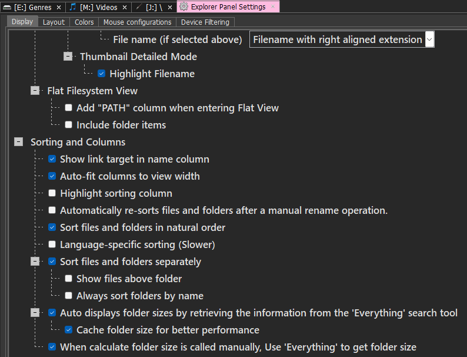

># 💯 Useful tools 💯

(In progress...🚧) 
>## 🪟 Windows Tools
|🛠️ Tool           |	🔗 App                                        |
|:---               |:---                                           |
|File Manager	      |[DoubleCommander](https://doublecmd.sourceforge.io/) - [MultiCommander](https://multicommander.com/) - [FreeCommander](https://freecommander.com/) *|
|File Finder	      |[Everything](https://www.voidtools.com/)       |
|Password Manager	  |[KeePassXC](https://keepassxc.org/) - [Bitwarden](https://bitwarden.com/) *|
|System Tools      |[PowerToys](https://learn.microsoft.com/en-us/windows/powertoys/) - [NirSoft](https://www.nirsoft.net/) - [Ninite](https://ninite.com/) - [Winaero Tweaker](https://winaerotweaker.com/) - [Sysinternals](https://learn.microsoft.com/en-us/sysinternals/downloads/)|
|App Launcher	      |[Flow Launcher](https://www.flowlauncher.com/) - [WinLaunch](https://winlaunch.com/) |
|Taskbar	          |[Windhawk](#windhawk)               |
|Backup & File Sync |[Aomei Backupper](https://www.aomeitech.com/ab) - [FreeFileSync](https://freefilesync.org/) - [Syncthing](https://syncthing.net/)|
|Browser	          |[Brave](https://brave.com/) - [LibreWolf](https://librewolf.net/)                    |
|Shell Prompt	      |[Oh My Posh](https://ohmyposh.dev/)            |
|Music Player	      |[MusicBee](https://getmusicbee.com/) - [Foobar2000](https://www.foobar2000.org/)|
|Note Taking	      |[Notion](https://www.notion.com/) - [Notesnook](https://notesnook.com/) *|
|Screen Recording	  |[OBS Studio](https://obsproject.com/)          |
|USB Drive Letter Manager|[USBDLM](https://www.uwe-sieber.de/usbdlm_e.html)|
|Status Bar	        |[Yasb](https://github.com/amnweb/yasb) *         |
|Window Manager     |[GlazeWM](https://github.com/glzr-io/glazewm) *  |
|System Fetch	      |[Fastfetch](https://github.com/fastfetch-cli/fastfetch) *|

> ##  👨🏽‍💻 Dev Tools
|🛠️ Tool           |	🔗 App                                        |
|:---               |:---                                           |
|Code/Text Editor   |[VSCode](https://code.visualstudio.com/) - [Notepad++](https://notepad-plus-plus.org/) - [Sublime Text](https://www.sublimetext.com/) *|

### 🔌VSCode Extensions:
|🛠️ Tool	          |🔗 App                                         |
|:---               |:---                                           |
|API                |[REST Client](https://marketplace.visualstudio.com/items?itemName=humao.rest-client)|
|Appearance         |[Catppuccin](https://marketplace.visualstudio.com/items?itemName=Catppuccin.catppuccin-vsc) * - [Catppuccin Icons](https://marketplace.visualstudio.com/items?itemName=Catppuccin.catppuccin-vsc-icons) * - [VSCode Pets](https://marketplace.visualstudio.com/items?itemName=tonybaloney.vscode-pets) *|

>## 🌐 Online tools:
|🛠️ Tool	          |🔗 App                                         |
|:---               |:---                                           |
|Temp Mail          |[Temp Mail](https://temp-mail.org/en/)         |
|Emojipedia         |[Emojipedia](https://emojipedia.org/)          |
|Media Store        |[MediaFire](https://www.mediafire.com/) * - [cloudinary.com](https://cloudinary.com/) *|

>## Other:
|🛠️ Tool	         |🔗 App                                          |
|:---               |:---                                           | 
|Colorscheme	      |[Catppuccin Mocha](https://catppuccin.com/palette/) *           |
|Font	              |[JetBrains Mono Nerd Font](https://www.jetbrains.com/lp/mono/) *|  

---
---
### ▶️[Oh My Posh](https://ohmyposh.dev/)

#### Windows Installation
- [Tutorial - Set up a custom prompt for PowerShell or WSL with Oh My Posh](https://learn.microsoft.com/en-us/windows/terminal/tutorials/custom-prompt-setup?source=docs)
- [ohmyposh.dev Windows Installation](https://ohmyposh.dev/docs/installation/windows)

#### Customize
- [themes](https://ohmyposh.dev/docs/themes)
- [segments](https://ohmyposh.dev/docs/segments)
---
---
### 🔎[Everything](https://www.voidtools.com/)
#### 📁 TIP: Show the size of folders

To show the size of folders in **Everything, Explorer and Multicommander** follow the next steps:

1. In Everything:

    Menu > Tools > Indexes > (*check*) Index Folder Size

    

1. In Windhawk:

    > With **Better file sizes in Explorer** installed and Everything previous configuration, you can see the size of folders in Windows Explorer.
1. In Multicommander:
  
    In Menu > Configuration > Explorer Panel Settings, in **Sorting and Columns** branch:
    - Check "Auto displays folder sizes by retrieving the information from the Everything search tool"
    - When calculate folder size is called manually, use 'Everything'...
  

---
---
### 🖥️[Windhawk](https://windhawk.net/)

#### Installed Mods
This are the modes I use:

\* I don't use these tools, but maybe you like them.             